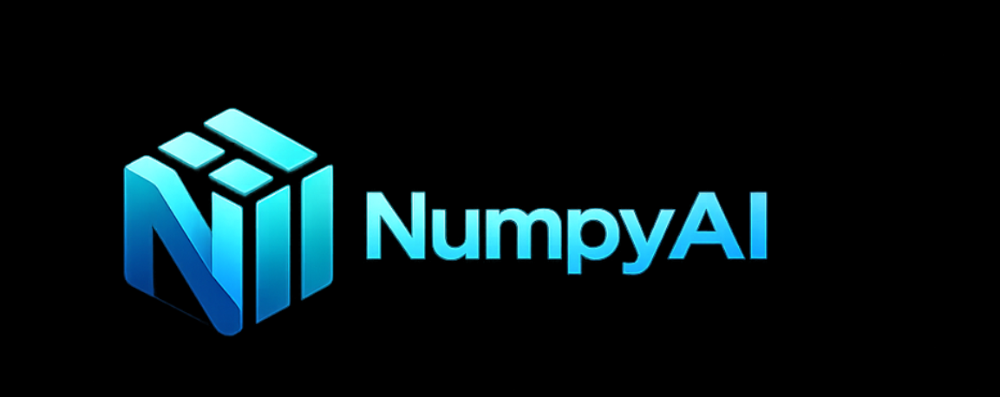

<p align="center">

</p>

# NumpyAI

A natural-language interface for [NumPy](https://github.com/numpy/numpy), powered by LLMs.

NumpyAI lets you interact with NumPy arrays using plain English. It ships as a small,
provider-agnostic library built on top of [Pydantic AI](https://ai.pydantic.dev/) - so
you can plug in Google Gemini, OpenAI, Anthropic, or any other model Pydantic AI supports
without touching the library code.

## Features

- Ask questions in English; NumpyAI generates and executes NumPy code for you.
- `numpyai.Diagnosis` suggests analysis steps for your data.
- `numpyai.NumpyAISession` chats over multiple arrays at once.
- Generated code is syntax-checked and independently validated before returning.
- Automatic retries with error context.
- Verbose mode (`verbose=True`) prints every intermediate step.
- Provider-agnostic - any Pydantic AI model spec works.

## Installation

```sh
pip install "numpyai[all]"
```

Or install only the providers you need:

```sh
pip install "numpyai[google]"    # Google Gemini
pip install "numpyai[openai]"    # OpenAI
pip install "numpyai[anthropic]" # Anthropic Claude
```

### From source

```sh
git clone https://github.com/AadyaChinubhai/numpyai
cd numpyai
pip install -e ".[all,dev]"
```

## Setup

Set the API key for your chosen provider. Pydantic AI reads standard env vars:

| Provider  | Environment variable  |
| --------- | --------------------- |
| Google    | `GEMINI_API_KEY`      |
| OpenAI    | `OPENAI_API_KEY`      |
| Anthropic | `ANTHROPIC_API_KEY`   |

```sh
export GEMINI_API_KEY=...
```

## Usage

### Single array

```python
import numpy as np
import numpyai as npi

data = np.array([[1, 2, 3, 4, 5, np.nan], [np.nan, 3, 5, 3.1415, 2, 2]])
arr = npi.array(data)  # defaults to google:gemini-2.5-flash

print(arr.chat("Compute the height and width of the image using NumPy."))
# Expected output: (2, 6)
```

### Choosing a model

Pass any Pydantic AI model spec via `model=`:

```python
npi.array(data, model="anthropic:claude-sonnet-4-5")
npi.array(data, model="openai:gpt-4o")
npi.array(data, model="google:gemini-2.5-pro")
```

You can also pass a pre-configured `pydantic_ai.models.Model` instance for full control.

### Multiple arrays

```python
import numpy as np
import numpyai as npi

arr1 = np.array([[1, 2, 3], [4, 5, 6]])
arr2 = np.random.random((2, 3))

sess = npi.NumpyAISession([arr1, arr2])
imputed = sess.chat("Impute the first array with the mean of the second array.")
```

### Diagnosis

```python
sess = npi.NumpyAISession([arr1, arr2])
diag = npi.Diagnosis(sess)
steps = diag.steps(
    task="Give me exactly 7 pithy steps to select an ML model for this data."
)
```

## Supported LLM providers

Anything Pydantic AI supports - Google (Gemini), OpenAI, Anthropic, Groq, Mistral,
Ollama, and OpenAI-compatible endpoints. See the
[Pydantic AI model docs](https://ai.pydantic.dev/models/) for the full list.

## Contributing

- Format with `black` and lint with `ruff`.
- Add tests under `tests/`.
- Public API surface (`array`, `NumpyAISession`, `Diagnosis`) should stay stable.

## License

MIT - see [LICENSE](LICENSE).
